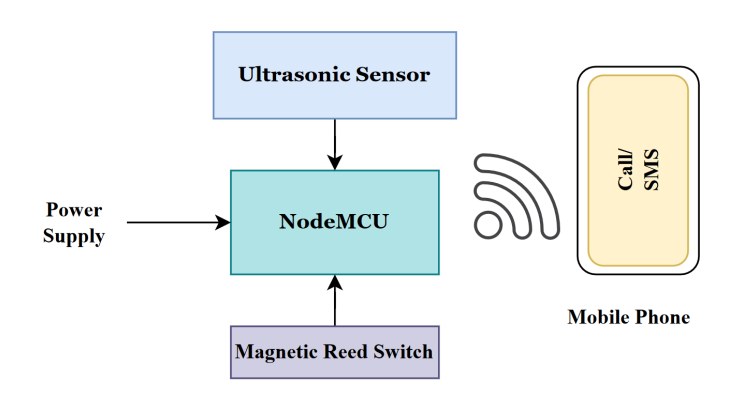
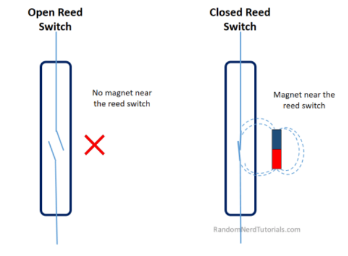
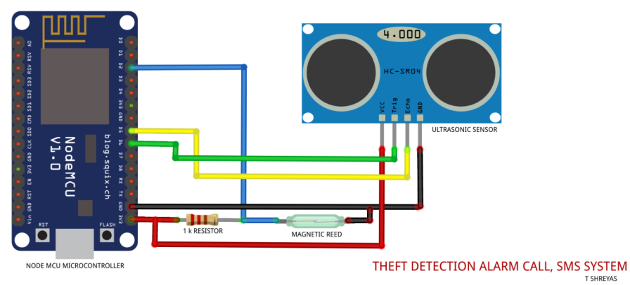
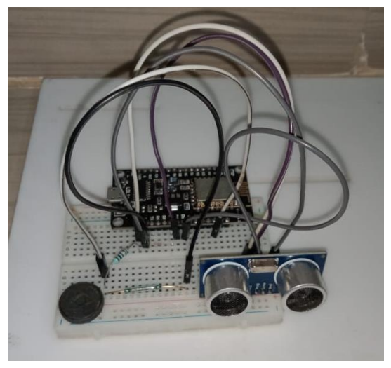
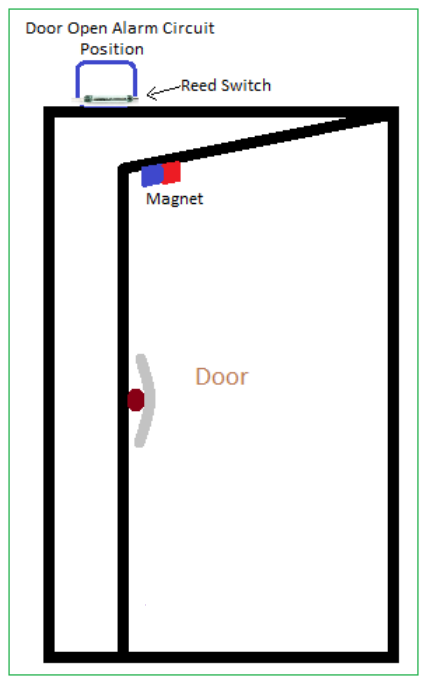
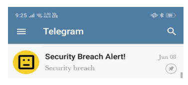
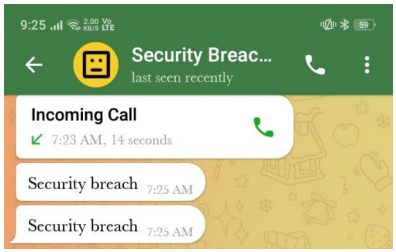

# IOT-Based-Burglar-Alarm-System

## ❖ Objectives:

I. Detects Unnecessary movement within a close proximity using ultrasonic sensor and sends an SMS to the user in case the distance is less than set threshold.

II. If the Closed door Attached with Magnetic reed Switch is openedforcibly without owners’ knowledge a telegram call is made to alert the owner of the house immediately to take police action on such suspicious activity.

## ❖ Block Diagram:
|  | 
|:--:| 
| **Figure 1 :** *Block Diagram* |

The NodeMCU collects information of Security breach from either Ultrasonic 
Sensor or the Magnetic Reed Switch and sends a SMS or Call to the User 
with the Help of IFTTT and Telegram Application alerting the user to take 
immediate effective action.

### ❖ Hardware Used:
i. NodeMCU ESP8266
ii. HC-SR04 ultrasonic sensor
iii. Magnetic Reed Switch
iv. Connecting wires and Resistors:

### ❖ Working Principle of Magnetic Reed Switch:
The simplest magnetic-field sensor is a reed switch. It contains two 
ferromagnetic nickel and iron reed elements in an evacuated, hermetically 
sealed glass tube to minimize contact arcing. The switching mechanism is 
comprised of those two ferromagnetic blades, separated by only a few 
microns. When a magnet approaches these blades, the two blades pull 
toward one another. Once touching, the blades close the normally open (NO) 
contacts, allowing electricity to flow. Some reed switches also contain a non-ferromagnetic contact, which forms a normally closed (NC) output. An 
approaching magnet will disconnect the contact and pull away from the 
switching contact.

|  | 
|:--:| 
| **Figure 2 :** *Working Principle* |

## ❖ Methodology:
### ❖ IFTTT:
IFTTT derives its name from the programming conditional statement “if this, 
then that.” What the company provides is a software platform that connects 
apps, devices and services from different developers in order to trigger one or 
more automations involving those apps, devices and services.
### ❖ How IFTTT works?
The automations are accomplished via applets — which are sort of like 
macros that connect multiple apps to run automated tasks. We can 
turn on or off an applet using IFTTT’s website or mobile apps (and/or 
the mobile apps’ IFTTT widgets). We can also create your own 
applets or make variations of existing ones via IFTTT’s user-friendly, 
straightforward interface.
### ❖ Applets Used:
a) Webhooks: A Webhook allows you to integrate with services 
that are not already on IFTTT using simple web requests. These 
Webhooks are unique to you using your own unique URL key, 
which can be found in the Documentation section of the 
Webhooks service page. A Webhook can act as both a trigger 
and an action, so the web requests are extremely flexible and 
customizable.
b) CallMeBot Phone Call integrations: Make Free Telegram 
Phone Calls when a Trigger is fired. A Robot telegram bot will 
Call you. This service requires a Telegram App installed in your 
phone to receive calls.
c) Android SMS integrations: Android SMS is a native service 
that allows you to receive Short Message Service (SMS) 
messages on your device and send messages to other phone 
numbers. Standard carrier rates may apply. This service 
requires the IFTTT app for Android.

|  | 
|:--:| 
| **Figure 3 :** *IFTTT Applets* |

## Circuit Schematic:
|  | 
|:--:| 
| **Figure 4 :** *Circuit Schematic* |

The echo and trigger pins of the ultrasonic sensor is connected to 
Digital pins D5 and D6 of NodeMCU respectively. The magnetic reed switch 
is connected to Digital pin D2 of NodeMCU. The powers supply and ground 
terminals are respectively connected to 3V and GND pins of NodeMCU 
Microcontroller.

## Hardware Implemented Circuit:

|  | 
|:--:| 
| **Figure 5 :** *Hardware Implimented Circuit* |

## Working:
Case-1: The Circuit setup is implemented as shown in figure 8 with some 
threshold set to the ultrasonic sensor and is turned on. If the ultrasonic 
threshold is surpassed then automatically an SMS is deployed through 
IFTTT Android SMS applet from NodeMCU microcontroller to the concerned 
Phone number already registered while building the Applet.

Case-2: The Circuit is placed along the door/vault-door such that the 
magnet is attached along the door and the circuit attached on the rim of the 
wall as shown in figure 6.

|  | 
|:--:| 
| **Figure 6 :** *Circuit Position wrt Door* |

Close the door and turn on the circuit. If the door is opened forcibly 
attempting burglary. The reed switch loses its contact with the magnet and 
immediately (within 15 secs) a telegram call is made to the concerned user 
reporting the issue through the help of CallMeBot Phone Call integrations
IFTTT applet from NodeMCU microcontroller.
We even receive telegram messages along with the call indicating the time of 
the breach.

## Results and Observations:
➢ SMS obtained once anyone as close as less than 8cm towards the 
specified secured target.
|  | 
|:--:| 
| **Figure 7 :** *SMS Notification* |

|  | 
|:--:| 
| **Figure 7 :** *Message received* |

➢ Telegram Notification Message and phone call (30 sec) both are 
received once the Door is opened in attempt of Burglary.

|  | 
|:--:| 
| **Figure 8 :** *Telegram Bot* |

|  | 
|:--:| 
| **Figure 9 :** *Security breach Telegram text and call notification* |

## Advantages:
➢ They can be used for multiple sensor functions like position sensing, 
speed sensing as well as for sensing the direction of movement too.

➢ As they are solid state devices, there is absolutely no wear and tear 
due to absence of moving parts.

➢ They are almost maintenance free.

➢ They are robust.

➢ They are immune to vibration, dust and water.

## Disadvantages:
➢ They are not capable to measure current flow at a distance more than 
10 cm. The only solution to overcome this issue is to use a very 
strong magnet that can generate a wide magnetic field.

➢ Accuracy of the measured value is always a concern as external 
magnetic fields may affect the values.

➢ High Temperature affects the conductor resistance. This will in turn 
affect the charge carrier’s mobility and sensitivity of Magnetic reed 
Sensors.

## Applications:
➢ Siren Annunciation.

➢ Magnetic Door Release.

➢ Border security control and defense purposes.

➢ Security systems in banking sectors such as lockers or safes.

➢ Small Motor Control.

➢ Prisons/Jails and Zoological gardens.

➢ In SMART Homes as Door Tamper Alarm.

## Conclusion:
This project gives a conclusion that the type of alarm system used here is 
based on Magnetic reed effect and ultrasonic principle. The main objective of 
the simulation project is to maintain safety of a house while no one is 
present. If there is any emergency which needs to be attended soon and the 
house is left alone, our theft detection alarm comes into picture. If any 
burglar tries to break into the house without keys, then the magnetic field 
variation would put on the alarm and it would immediately send SMS or call 
the concerned authority about the theft going so that necessary action can 
be immediately taken against the culprits.
